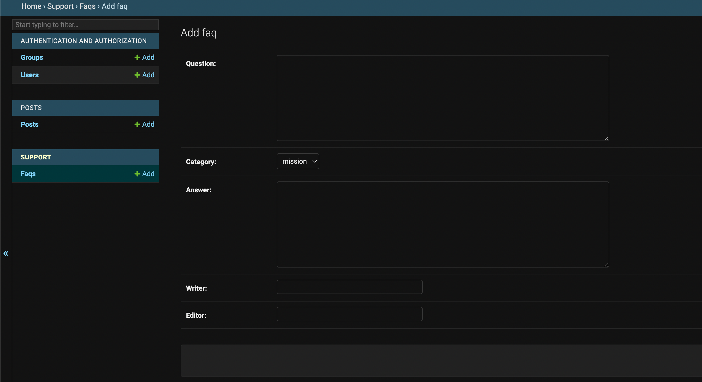
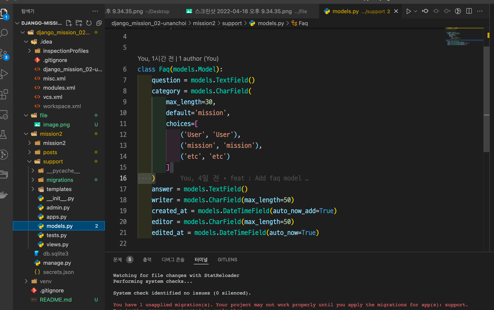

## 미션2
### 미션 내용 : 고객센터 앱과 FAQ 모델 만들기

- 사용자에게 자주묻는질문 제공을 위한 고객센터앱, 자주묻는질문 모델 생성

### 목표

- 장고 ORM Models, Fields에 대한 이해

### 요구사항

- 고객센터 앱 생성
    - 앱명 : `support`
- FAQ 모델 생성
    - 모델명 : `Faq`
    - 필드 : 질문, 카테고리, 답변, 생성자, 생성일시, 최종 수정자, 최종 수정일시

### 힌트

- `django-admin startapp support`
- 카테고리 사용 시 `choices` 사용
- 카테고리 목록 : 일반, 계정, 기타
- [https://docs.djangoproject.com/en/4.0/ref/models/fields/#field-types](https://docs.djangoproject.com/en/4.0/ref/models/fields/#field-types)
- [https://docs.djangoproject.com/en/4.0/ref/models/fields/#field-options](https://docs.djangoproject.com/en/4.0/ref/models/fields/#field-options)

### Faq Model 구현 결과

### source code 캡처 화면

